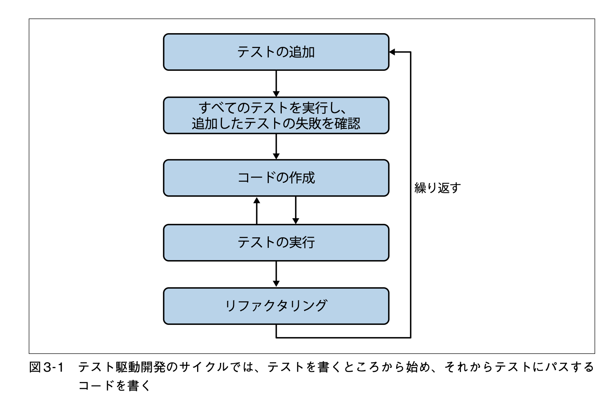
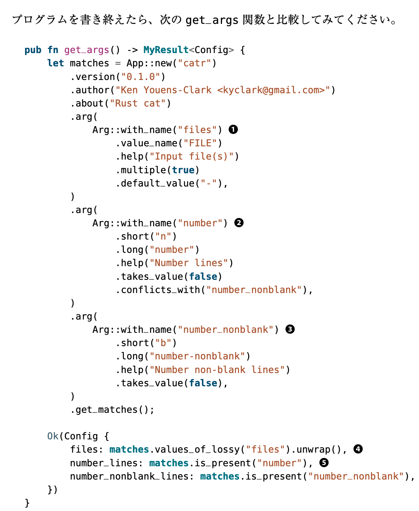

- [cat コマンド 実装するオプション](#cat-コマンド-実装するオプション)
- [テスト駆動開発](#テスト駆動開発)
- [準備](#準備)
  - [プログラムクレート](#プログラムクレート)
    - [chapter1 hello ライブラリ](#chapter1-hello-ライブラリ)
  - [引数の定義: Config構造体](#引数の定義-config構造体)
  - [ファイル引数の反復処理](#ファイル引数の反復処理)
  - [ファイル もしくは 標準入力を開く](#ファイル-もしくは-標準入力を開く)
    - [標準入力](#標準入力)
    - [存在するファイル](#存在するファイル)
    - [存在しないファイル](#存在しないファイル)
    - [権限のないファイル](#権限のないファイル)
    - [組み合わせ](#組み合わせ)
- [実装: ファイルから行を読み込む](#実装-ファイルから行を読み込む)
  - [失敗ログ1: BufRead.lines() イテレータの yield は `io::Result<String>` を返す](#失敗ログ1-bufreadlines-イテレータの-yield-は-ioresultstring-を返す)
  - [最終的な実装](#最終的な実装)
- [実装: 行番号の表示](#実装-行番号の表示)
  - [cat コマンドの出力](#cat-コマンドの出力)
  - [最終的な実装](#最終的な実装-1)
- [実装: helpの出力 修正](#実装-helpの出力-修正)


## cat コマンド 実装するオプション
- `-b|--number-nonblank`: 空白でない行番号を表示
- `-n|--number`: (空白の行も含む)行番号を表示

## テスト駆動開発

- 本章では、著者が作成したテストを使用する



## 準備

### プログラムクレート
- コードを `src/lib.rs` のライブラリ と、 そのライブラリを呼び出すための `src/main.rs` のバイナリに分けることを考える
  - 今後の拡張のため
- https://zenn.dev/tommy_aki/articles/f9f445dade8460

#### chapter1 hello ライブラリ
- `src/lib.rs`:
  - `MyResult`: `TestResult` のテンプレート版
  - **パブリック** 関数として `run()` を定義

```rust
use std::error::Error;

type MyResult<T> = Result<T, Box<dyn Error>>;

pub fn run() -> MyResult<()> {
    println!("Hello, world!");
    Ok(())
}
```

- `src/main.rs`
  - `lib.rs` 内のパブリック関数には、  `hello` クレートを使用することで利用できる
  - `hello::run()`
- if let: https://qiita.com/plotter/items/0d8dc2782f21178d64f1

```rust
fn main() {
    if let Err(e) = hello::run() {
        eprintln!("{}", e);
        std::process::exit(1);
    }
}
```

▫️ 実行:

```bash
tsuch@tsuch hello % cargo run --bin hello
   Compiling hello v0.1.0 (/Users/tsuch/eduam/__study__/PCN/rust/workshop-rust-study/chapter1/hello)
    Finished `dev` profile [unoptimized + debuginfo] target(s) in 1.17s
     Running `target/debug/hello`
Hello, world!
```

### 引数の定義: Config構造体
引数と対応する Config 構造体を作成し、 引数をパースする。

[構造体についてのdoc](https://doc.rust-jp.rs/rust-by-example-ja/custom_types/structs.html)

▫️ 答え合わせ:



```rust
use std::error::Error;
use clap::{App, Arg};

type MyResult<T> = Result<T, Box<dyn Error>>;

#[derive(Debug)]
pub struct Config {
    files: Vec<String>,
    number_lines: bool,
    number_nonblank_lines: bool,
}

pub fn get_args() -> MyResult<Config> {
    let matches = App::new("catr")
        .version("0.1.0")
        .author("Ken Youens-Clark <kyclark@gmail.com")
        .about("Rust cat")
        .arg(
            Arg::with_name("files")
                .value_name("FILE")
                .default_value("-")
                .multiple(true)
                .help("Input Files"),
        )
        .arg(
            Arg::with_name("number_lines")
                .short("n")
                .long("-number")
                .group("number_lines_group")
                .help("Number the output lines, starting at 1."),
        )
        .arg(
            Arg::with_name("number_nonblank_lines")
                .short("b")
                .long("-number-nonblank")
                .group("number_lines_group")
                .help("Number the non-blank output lines, starting at 1."),
        )
        .get_matches();

    let files = matches.values_of_lossy("files").unwrap();
    let number_lines = matches.is_present("number_lines");
    let number_nonblank_lines = matches.is_present("number_nonblank_lines");

    Ok(Config {
        files: files,
        number_lines: number_lines,
        number_nonblank_lines: number_nonblank_lines,
    })
}
```

- 答えは、 オプションの競合抑制に `group()` ではなく、 `conflicts_with()`を使用している
- 答えは、 値をとるかどうか(フラグかどうか)の設定に `takes_value()` を使用している
  - ただし、 [version 4.0.0](https://github.com/clap-rs/clap/blob/master/CHANGELOG.md#400---2022-09-28) から `takes_value()` は削除され、いくつかの関数とともに `num_args()` に統一された
  - ここでは version 2.33 を指定しているので、問題なく `takes_value()` を使用できる


-------

ここまでで、3.2.3 まで終わり

### ファイル引数の反復処理

- for 文を用いる: https://google.github.io/comprehensive-rust/ja/control-flow-basics/loops/for.html

```rust
pub fn run(config: Config) -> MyResult<()> {
    for filename in config.files {
        println!("{}", filename);
    }
    Ok(())
}
```

- 結果:

```bash
% cargo run -- tests/inputs/*.txt
...
tests/inputs/empty.txt
tests/inputs/fox.txt
tests/inputs/spiders.txt
tests/inputs/the-bustle.txt
```

### ファイル もしくは 標準入力を開く
- ファイル名がダッシュ `-` = デフォルトの場合、 標準入力を開く
- そうでなければ、 ファイルとして開く
- `match` 文で対応する: https://google.github.io/comprehensive-rust/ja/pattern-matching/match.html?highlight=match#matching-values

```rust
fn open(filename: &str) -> MyResult<Box<dyn BufRead>> {
    match filename {
        "-" => Ok(Box::new(BufReader::new(io::stdin())),
        _ => Ok(Box::new(BufReader::new(File::open(filename)?))),
    }
}
```

- ファイルオープンに成功した場合、 `File::open` は  ファイルハンドルとなる: `Result<File>`
- BufReader: https://doc.rust-lang.org/std/io/struct.BufReader.html#impl-BufRead-for-BufReader%3CR%3E
  - `BufRead` トレイトを実装している
- `Box` (https://doc.rust-lang.org/std/boxed/struct.Box.html) を使うことで、 ファイルハンドルを保持するヒープ上のメモリへのポインタを作成している
  - `A pointer type that uniquely owns a heap allocation of type T.`

#### 標準入力

```bash
% cargo run -- # 引数なし
...
Opened -
```

#### 存在するファイル

```bash
% cargo run -- tests/inputs/*.txt
...
Opened tests/inputs/empty.txt
Opened tests/inputs/fox.txt
Opened tests/inputs/spiders.txt
Opened tests/inputs/the-bustle.txt
```

#### 存在しないファイル

```bash
% cargo run -- tests/inputs/hoge.txt
...
Failed to open tests/inputs/hoge.txt: No such file or directory (os error 2)
```

#### 権限のないファイル

- 000 のファイルを作成

```bash
touch cant-touch-this && chmod 000 cant-touch-this
```

```bash
% cargo run -- cant-touch-this
...
Failed to open cant-touch-this: Permission denied (os error 13)
```

#### 組み合わせ

```bash
% cargo run -- tests/inputs/hoge.txt cant-touch-this tests/inputs/*.txt
...
Failed to open tests/inputs/hoge.txt: No such file or directory (os error 2)
Failed to open cant-touch-this: Permission denied (os error 13)
Opened tests/inputs/empty.txt
Opened tests/inputs/fox.txt
Opened tests/inputs/spiders.txt
Opened tests/inputs/the-bustle.txt
```


## 実装: ファイルから行を読み込む
- ファイルから行を読み込む (複数ファイル対応)

### 失敗ログ1: BufRead.lines() イテレータの yield は `io::Result<String>` を返す
- 下記コード:

```rust
pub fn run(config: Config) -> MyResult<()> {
    for filename in config.files {
        match open(&filename) {
            Err(err) => eprintln!("Failed to open {}: {}", filename, err),
            Ok(buf) => {
                for line in buf.lines() {
                    println!("{}", line);
                }
            },
        }
    }
    Ok(())
}
```

- 結果:

```bash
error[E0277]: `Result<String, std::io::Error>` doesn't implement `std::fmt::Display`
  --> src/lib.rs:83:36
   |
83 |                     println!("{}", line);
   |                               --   ^^^^ `Result<String, std::io::Error>` cannot be formatted with the default formatter
   |                               |
   |                               required by this formatting parameter
   |
   = help: the trait `std::fmt::Display` is not implemented for `Result<String, std::io::Error>`
   = note: in format strings you may be able to use `{:?}` (or {:#?} for pretty-print) instead

For more information about this error, try `rustc --explain E0277`.
error: could not compile `catr` (lib) due to 1 previous error
```

- lines() の説明: https://doc.rust-lang.org/std/io/trait.BufRead.html#method.lines

```
The iterator returned from this function will yield instances of io::Result<String>
```


### 最終的な実装
- `open(&filename)` に成功した場合、 `BufRead` を `buf` として受け取る
- `buf.lines()` で取得した line に対し、 `?` をかませる

```rust
pub fn run(config: Config) -> MyResult<()> {
    for filename in config.files {
        match open(&filename) {
            Err(err) => eprintln!("Failed to open {}: {}", filename, err),
            Ok(buf) => {
                for line in buf.lines() {
                    let line = line?;
                    println!("{}", line);
                }
            },
        }
    }
    Ok(())
}
```

## 実装: 行番号の表示

### cat コマンドの出力

- 複数ファイル: 続けて表示される

```
% cat ./tests/inputs/*.txt
The quick brown fox jumps over the lazy dog.
Don't worry, spiders,
I keep house
casually.
The bustle in a house
The morning after death
Is solemnest of industries
Enacted upon earth,—

The sweeping up the heart,
And putting love away
We shall not want to use again
Until eternity.
```

- 行番号あり `-n`: ファイルごとの行番号
  - 行番号は 空白あり6文字 & 右詰め
  - 行番号の次の文字はタブ

```bash
% cat -n ./tests/inputs/*.txt
     1  The quick brown fox jumps over the lazy dog.
     1  Don't worry, spiders,
     2  I keep house
     3  casually.
     1  The bustle in a house
     2  The morning after death
     3  Is solemnest of industries
     4  Enacted upon earth,—
     5
     6  The sweeping up the heart,
     7  And putting love away
     8  We shall not want to use again
     9  Until eternity.
```

### 最終的な実装

- 行番号は 空白あり6文字 & 右詰め: `print!("{:>6}\t", i);`
  - https://doc.rust-jp.rs/rust-by-example-ja/hello/print.html
  - ファイルが変わったらまた1から始める

```rust
pub fn run(config: Config) -> MyResult<()> {
    for filename in config.files {
        match open(&filename) {
            Err(err) => eprintln!("Failed to open {}: {}", filename, err),
            Ok(buf) => {
                let mut i = 1;
                for line in buf.lines() {
                    let line = line?;
                    if config.number_lines || (config.number_nonblank_lines && !line.is_empty()) {
                        print!("{:>6}\t", i);
                        i += 1;
                    }

                    println!("{}", line);
                }
            },
        }
    }
    Ok(())
}
```

## 実装: helpの出力 修正
※ テスト "usage" を通すための対応

- `App` の `before_help` で、 help 出力の前に出力する文字列を指定できる: https://cisco.github.io/lal-build-manager/clap/struct.App.html#method.before_help
  - `after_help` もある

```rust
    let matches = App::new("catr")
        .version("0.1.0")
        .author("Ken Youens-Clark <kyclark@gmail.com>")
        .about("Rust cat")
        ...
        .before_help("Usage:")
        .get_matches();
```
